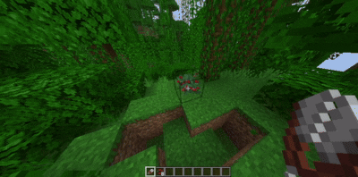

# BerryBushPlugin

[](https://github.com/Kredwi/BerryBushPlugin/actions/workflows/maven.yml)
[](https://github.com/Kredwi/BerryBushPlugin/releases)
[](https://github.com/Kredwi/BerryBushPlugin/releases)
[](https://github.com/Kredwi/BerryBushPlugin/releases)
[](https://github.com/Kredwi/BerryBushPlugin/releases)
[](https://github.com/Kredwi/BerryBushPlugin/blob/master/LICENSE)

## Demo
[](https://github.com/Kredwi/BerryBushPlugin/releases)

## Basic Information

A Minecraft plugin that adds slow breaking for sweet berries.

### Versions

- Minecraft **1.14.4 - lastest**
- \*WorldGuard **7.0.1**
- \*Vault **1.7.3**

  _\*Optional_

### Permissions

- `bbush.fast` – if a player has this permission, sweet berries will become ripe instantly.
- `bbush.access` – allows interaction with sweet berries.

### How does the clamping processing work?
When the player clamps on a block, the server calls **PlayerInteractEvent** a bunch of times.
We take the past time of the click, and compare it with the current one, and based on the results, we understand: Is the player clamping, or has he stopped clamping?
The parameter in the config `bush.max-click-interval` just answers: What is the maximum interval that must pass between clicks, so that the plugin considers it clamping, and not just a click

## Configuration
```yaml
version: 1 # config version
debug: false # enable more logging

bush:
  visible: true # enable visible break
  cooldown: 20 # Cooldown in seconds before the same bush can be harvested again
  break-time: 5 # Time in seconds required to hold right-click to harvest
  final-action: ONLY_DROP # SET_TO_MINIMAL, ONLY_DROP, or BREAK
  max-click-interval: 250 # Max time in milliseconds between clicks before reset
  sound: # seciton of sounds
    instrument: ENTITY_SHEEP_SHEAR # bukkit particle name for break instrument
    bush: BLOCK_SWEET_BERRY_BUSH_BREAK # bukkit particle name for break bush
  particle: # section of particles
    enable: true # enalbe particles
    particle: BLOCK_DUST # bukkit particle name
    count-stage: 64 # number of count particles for stages
    count-last: 194 # number of count particles for last stage

# Section of addons
depend:
  worldguard:
    enable: true
  vault:
    enable: true
    harvest-reward: 255.0

messages:
  no-permission: "§cYou cannot interact with this crop"
  wrong-item: "§cYou need shears to harvest this crop"
  non-grown: "§cThis crop is not ready to harvest"
  cooldown: "§cWait {0} seconds before harvesting again"
  holding: "§eHold for {0}s"
  cancelled: "§cHarvest cancelled"
  vault: # Vault addon messages
    reward: "§aYou rewarded {0}$"
```